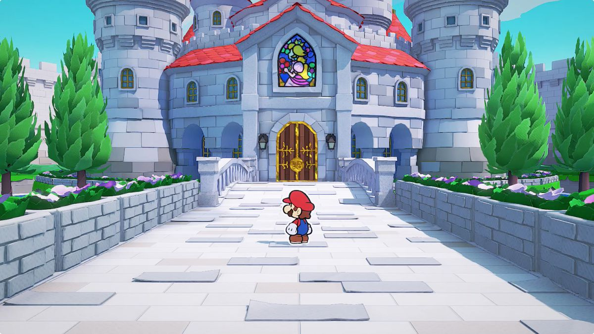

# Style
At all times when making anything audiovisual, consider that the game should be grainy and disturbing. Moving actors will be drawn in 2D, a la 'Don't Starve', but the sprites should be drawn in a 3D world (think Pokémon B&W, Paper Mario)

Drawing further from Don't Starve, and also Fran Bow as artistic inspirations would be effective, as these styles are really good at portraying eldritch horror, and are better suited for Junji Ito's work.

To fit Ito's work artistically we will draw 2D 

\centering

{width=200px}
***A Shadow Creature from Don't Starve***

\raggedright

## Character Art
Characters (drawn in 2D) should be messy, almost scribbles, their animations making them almost fall apart while they shamble about.

## Environments
Environments will be rendered in 3D, they should be grungy and filthy, and low-detail enough to fit in with the 2D Characters. Think about Paper Mario's environments.

\centering

\raggedright

# Cutting Corners
We are *on the clock*. We cannot afford to make a finished game, so we are making a ***DEMO***. As this paragraph is being written, we are exactly 1 week into the project, with 6 weeks left.

We are making **one** level, and polishing it to be as high-quality as possible.

\[TODO: ADD MORE HERE\]

# Gameplay
The name of the game is Survival Horror, except that's not the name because we don't have a name yet. Gameplay will revolve around stealth, as well as limited combat in the form of broken weapons and almost-impossible-to-kill enemies. Combat should not be a main facet, but a janky last resort. The monster interactions should still feel rewarding and engaging to play. 

Each monster we do end up implementing should be *based on* if not ***directly referencing*** a monster from Ito's work. Each fight should have a unique gimmick that the player should learn and master. We will then layer these monster interactions to keep the gameplay fresh, forcing the player to use what they've learned at the same time.